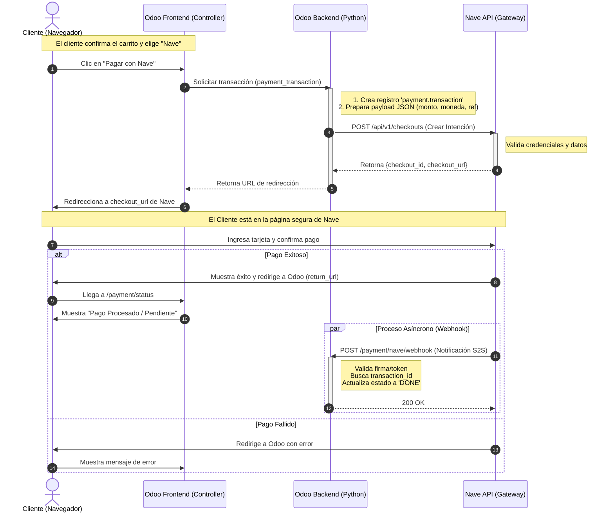
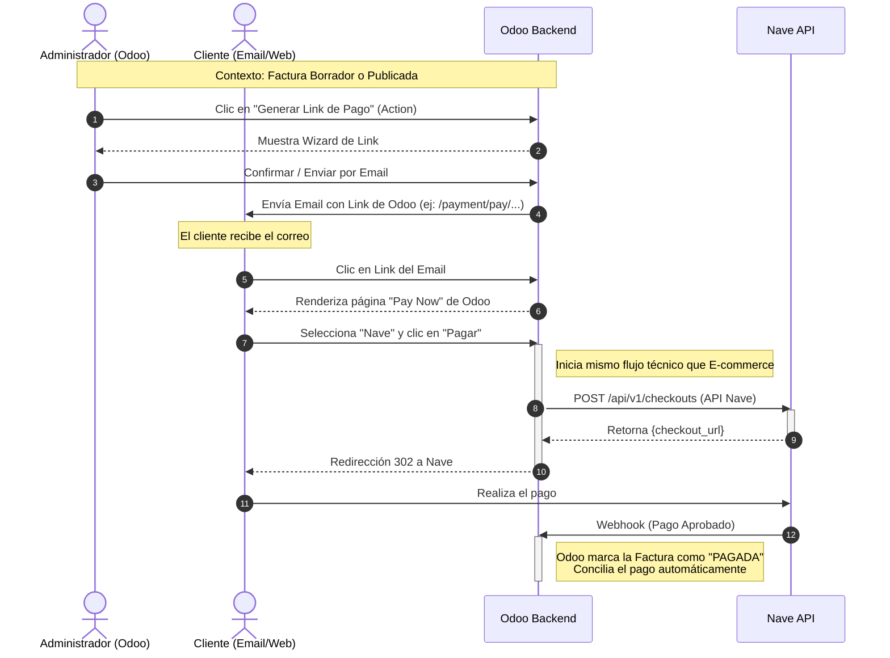

**COBROS ONLINE**  
Checkout & Link de pago  
Documentación interna - preview 02/12/2025  
**Planificación de Proyecto: Integración Odoo 18 - Nave**  
**Recursos:** 1 Desarrollador Senior Odoo (Python/JS), 1 Tester/QA.  
   
 **Metodología:** Ágil / Kanban.  
   
 **Total Estimado:** 40 Horas (sin contar gestión ni homologación).  
***Semana 1: Desarrollo del Core y E-commerce (20-24 horas)***  
El objetivo de esta semana es tener el módulo instalado y procesando un pago básico en entorno Sandbox.  
| | | | |  
|-|-|-|-|  
| **Día** | **Tarea (Desarrollo)** | **Descripción Técnica (Odoo 18.0)** | **Horas Est.** |   
| **Día 1** | **Configuración y Estructura** | • Creación del módulo payment_nave. • Herencia de payment.provider. • Vistas de configuración (API Keys, Ambiente). • Definición de iconos y assets. | 4h |   
| **Día 1** | **Conexión API (Auth)** | • Implementación de cliente HTTP para Nave. • Generación de tokens/autenticación (Header Authorization). • Pruebas de conexión ping con Sandbox. | 2h |   
| **Día 2** | **Lógica de Checkout (Request)** | • Sobrescritura de _get_specific_rendering_values. • Mapeo de datos: Partner, Currency, Amount. • **Importante:** Implementación de generación de checkout_url (API Call a Nave). | 6h |   
| **Día 3** | **Controlador y Redirección** | • Creación del Controller /payment/nave/return. • Manejo de la redirección del usuario hacia Nave. • Manejo del retorno (Success/Cancel) desde Nave a Odoo. | 6h |   
| **Día 4** | **Webhooks (S2S Notifications)** | • Endpoint /payment/nave/webhook. • Validación de firma de seguridad de Nave. • Método _handle_notification_data para cambiar estado a DONE. | 6h |   
   
***Semana 2: Link de Pago Backend, Refinamiento y QA (16-18 horas)***  
El objetivo es finalizar la funcionalidad de backend y asegurar la calidad.  
| | | | |  
|-|-|-|-|  
| **Día** | **Tarea (Desarrollo / QA)** | **Descripción Técnica** | **Horas Est.** |   
| **Día 5** | **Link de Pago (Backend)** | • Adaptación para wizard "Generar Link de Pago". • Asegurar que la URL generada invoca el mismo controlador que el e-commerce. • Pruebas sobre Facturas (Account Move) y Ventas (Sale Order). | 4h |   
| **Día 5** | **Manejo de Errores y Logs** | • Gestión de tarjetas rechazadas. • Logging detallado para facilitar la homologación futura. • Mensajes de usuario (Traducciones). | 2h |   
| **Día 6** | **QA - Ronda 1 (Funcional)** | • Pruebas de flujo E-commerce (Guest y Logueado). • Pruebas de Link de Pago enviado por correo. • Verificación de creación de asientos contables. | 4h (QA) |   
| **Día 7** | **Corrección de Bugs** | • Ajustes basados en el feedback del QA del día 6. • Ajustes visuales en el checkout. | 3h (Dev) |   
| **Día 7** | **QA - Ronda 2 (Stress/Negativo)** | • Pruebas de fallos (timeouts, cancelación de usuario). • Pruebas de seguridad (intentar pagar monto diferente). • Validación de estados (Draft, Pending, Paid). | 3h (QA) |   
| **Día 8** | **Documentación Técnica** | • README para instalación. • Guía de configuración para el admin. | 1h (Dev) |   
   
***Fase 3: Homologación (Tiempo indeterminado - Depende de Nave)***  
Una vez consumidas las 40 horas internas, inicia el proceso externo.  
1. **Solicitud de Homologación:** Enviar formulario a Nave indicando que la integración está lista en Sandbox.  
2. **Ejecución de Script de Pruebas:** Nave enviará un Excel/Guía con casos de prueba obligatorios (ej: Pago aprobado, Pago rechazado por fondos, Pago rechazado por fraude, Devolución parcial).  
- *Nota:* Esto requiere que un funcional o el desarrollador ejecute estas pruebas manualmente y tome capturas de pantalla o logs.  
3. **Certificación:** Nave revisa las evidencias. Si todo está bien, otorgan las credenciales de  **Producción**.  
4. **Pase a Producción:** Cambiar el switch en Odoo a "Environment: Production" e ingresar las nuevas llaves.  
- **Backend & API Core:** 14 horas  
- **Webhooks & Seguridad:** 6 horas  
- **Adaptación Backend Link:** 4 horas  
- **Refinamiento y Fixes:** 6 horas  
- **QA & Testing:** 10 horas  
- **TOTAL:** 40 horas  
**Diagrama de integración Checkout en E-commerce de odoo**  
Este flujo ocurre cuando un cliente entra a tu sitio web, llena el carrito y procede a pagar.  
   
 Nota: El módulo integra como un proveedor de pago dentro del sistema.  

**Diagrama de integración Link de Pago desde Backend (Facturas/Ventas)**  
Este escenario cubre el requerimiento de "implementar en el back-end". En Odoo, esto se logra usando el asistente "Generar Link de Pago" en una Factura o Pedido de Venta.  
   
 Nota: El administrador genera el link, pero es el cliente quien ejecuta el pago.  

