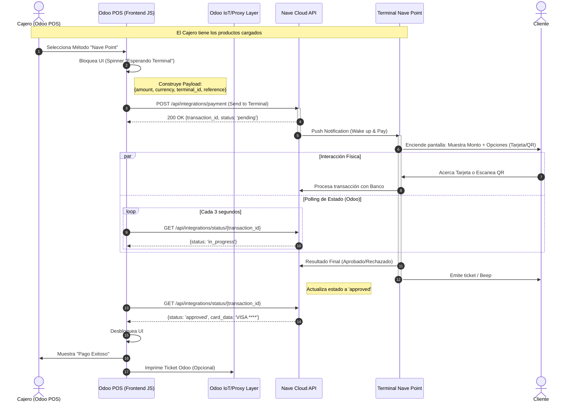

**PAGOS PRESENCIALES**  
Nave Point & QR  
Documentación interna - preview 12/12/2025  
**Planificación del Proyecto (50h Dev + 10h QA)**  
Debido a la complejidad de hardware y la lógica asíncrona (Odoo espera al terminal), se estima un esfuerzo mayor.  
**Recursos:** 1 Desarrollador Senior (Fuerte en JS/OWL y Odoo POS), 1 Tester, 2 Terminales Nave Point.  **Sprint Sugerido:** 3 Semanas (considerando tiempos de "prueba y error" con el hardware).  
***Semana 1: Arquitectura y Conexión Básica (18 horas)***  
El objetivo es lograr que Odoo "se comunique" con la API de Nave y que el terminal reaccione (encienda pantalla).  
| | | |  
|-|-|-|  
| **Tarea (Desarrollo)** | **Descripción Técnica (Odoo 18 POS)** | **Horas Est.** |   
| **Modelado de Terminales** | Crear modelo pos.payment.method extendido para guardar: nave_terminal_id, api_key. Lógica para vincular un Terminal físico a una Caja (Config). | 6h |   
| **Cliente API JS** | Crear la clase en JS (Assets del POS) para manejar la comunicación HTTP con Nave Cloud. Manejo de autenticación y headers. | 6h |   
| **Prueba "Hola Mundo"** | Crear un botón de prueba en Odoo que envíe un monto fijo ($1) al terminal físico para verificar conectividad y recepción de Push en el dispositivo. | 6h |   
   
***Semana 2: Lógica de Pago e Interfaz (20 horas)***  
Implementar el flujo completo de cobro dentro del ciclo de vida de la orden de Odoo.  
| | | |  
|-|-|-|  
| **Tarea (Desarrollo)** | **Descripción Técnica** | **Horas Est.** |   
| **Implementación PaymentInterface** | Heredar PaymentInterface en Odoo POS JS. Implementar métodos send_payment_request y send_payment_cancel. | 8h |   
| **Manejo de Respuestas (Polling)** | Implementar el loop (interval) que consulta a la API de Nave el estado del pago mientras el cliente opera el terminal. | 6h |   
| **Manejo de QR vs Tarjeta** | Asegurar que la petición soporte ambos modos. Si Nave requiere flags distintos para QR, agregar botón o configuración para "Forzar QR". | 4h |   
| **UI/UX en POS** | Mostrar mensajes claros al cajero: "Esperando tarjeta...", "Cliente ingresando PIN", "Error de conexión". | 2h |   
   
***Semana 3: Robustez, Cancelaciones y QA (12h Dev + 10h QA)***  
Manejo de casos bordes (el cliente se arrepiente, se corta internet, tarjeta rechazada).  
| | | |  
|-|-|-|  
| **Tarea (Desarrollo / QA)** | **Descripción Técnica** | **Horas Est.** |   
| **Cancelaciones** | Lógica para enviar señal de cancelación desde Odoo al Terminal (si el cajero se equivocó de monto antes de que el cliente pague). | 4h |   
| **Manejo de Errores** | Gestión de Timeouts (si el terminal no responde en 60s). Gestión de rechazos (Fondos insuficientes). Retry logic. | 4h |   
| **Cierre de Caja y Conciliación** | Asegurar que los pagos se registren con el transaction_id correcto en el backend para futura conciliación contable. | 4h |   
| **QA - Pruebas Físicas** | **QA Tester (10hs):** 1. Pago exitoso Crédito/Débito. 2. Pago exitoso QR (Billetera virtual). 3. Cancelación desde el POS. 4. Cancelación desde el Terminal (Botón rojo). 5. Tarjeta rechazada/vencida. 6. Pérdida de conectividad (simulada). | 10h (QA) |   
   
**Resumen de Distribución de Horas (Desarrollo)**  
1. **Configuración Backend y Modelos:** 6h  
2. **Comunicación API (JS Layer):** 12h  
3. **Lógica Core POS (Request/Polling):** 14h  
4. **UI/UX y Flujos Alternativos:** 6h  
5. **Manejo de Errores y Cancelaciones:** 8h  
6. **Conciliación de Datos:** 4h  
7. **TOTAL DESARROLLO:** 50 horas  
**Consideraciones para la Homologación (Pagos Presenciales)**  
Probablemente la homologación de POS es más estricta que la Web (información que nos tiene que proporcionar Nave):  
1. **Video de prueba:** Grabar la pantalla del POS y el terminal físico simultáneamente mostrando la transacción.  
2. **Impresión de Ticket:** Verificar que el ticket de Odoo (o el del terminal) cumpla con la normativa de mostrar los últimos 4 dígitos de la tarjeta y el número de lote/autorización (Datos devueltos por la API).  
3. **Pruebas de Devolución (Refunds):** A veces piden probar la anulación de una compra desde Odoo. *N* *ota: Esta planificación incluye la arquitectura para cobros. Las devoluciones automáticas integradas (desde Odoo hacia el terminal para devolver dinero) suelen ser un desarrollo aparte o en terceras fases; en fase 1 se suelen hacer manuales en el terminal.*  
**Pago en Punto de Venta (POS) con Nave Point**  
Este flujo cubre tanto pago con Tarjeta como QR dinámico mostrado en la pantalla del terminal Nave. En los dispositivos modernos (Android), Odoo envía la orden de cobro y el terminal gestiona si lee chip, banda o muestra el QR.  

