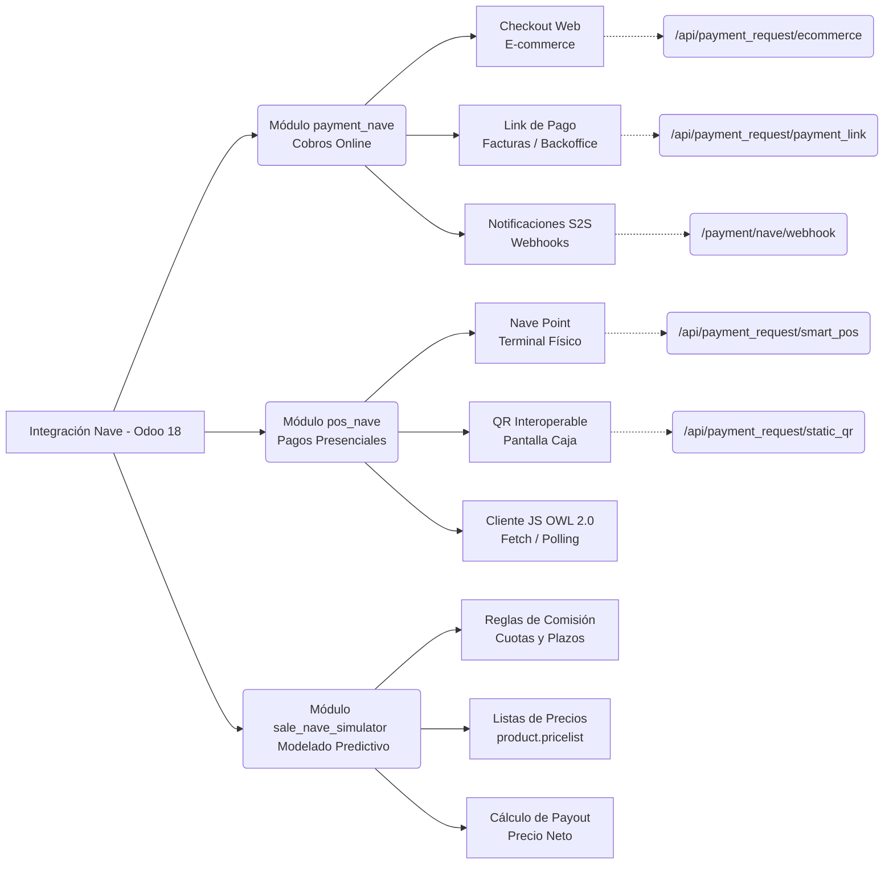

# Spec Driven Development: Integración Nave - Odoo 18.0

De acuerdo a la documentación analizada y los lineamientos de desarrollo de Odoo 18 (`.agent/rules.md`), el alcance del proyecto requiere el desarrollo de **dos módulos independientes pero complementarios**, alineados a la arquitectura base de Odoo (`payment` para E-commerce/Links y `point_of_sale` para terminales físicas).

## User Review Required
> [!NOTE]
> **Definición de API**: He podido acceder a la documentación oficial del Portal de Desarrolladores de Nave para **Pagos Presenciales (QR Interoperable)**. Ya contamos con los endpoints de Autenticación (`/security-ms/api/security/auth0/b2b/m2msPrivate`), Creación de Intención QR (`/api/payment_request/static_qr`), y Webhooks. Utilizaremos estos estándares oficiales. 
> 
> **Nomenclatura**: Los módulos a construir serán `payment_nave` (Online) y `pos_nave` (Presencial).

---

## Proposed Changes

### Cuadro Sinóptico de Arquitectura

---

### Componente 1: `payment_nave` (Cobros Online & E-commerce)
Este módulo se encargará del Checkout web y Links de pago vía email/backend. Hereda funcionalmente del módulo base `payment` (al estilo de `payment_stripe`).

#### [NEW] payment_nave/__manifest__.py
Definición del módulo, dependencias (`payment`, `account`), y configuración.
#### [NEW] payment_nave/models/payment_provider.py
Implementación del proveedor Nave.
- Campos para configuraciones: `nave_client_id`, `nave_client_secret`, `nave_environment` (test/prod).
- Implementación del método base `_compute_feature_support_fields` y obtención de métodos de pago.
- Lógica de autenticación: `POST /security-ms/api/security/auth0/b2b/m2msPrivate` para obtener y cachear el Bearer Token.
#### [NEW] payment_nave/models/payment_transaction.py
La lógica central de cobros.
- `_get_specific_rendering_values`: 
  - Para E-commerce: Invoca `POST /api/payment_request/ecommerce` mapeando `amount`, `seller.pos_id`, `callback_url` y **obligatoriamente** el `buyer.user_id` (mapeado desde el `partner_id` de Odoo) para habilitar internamente a Nave a ofrecer tarjetas guardadas (Tokenización/`card_on_file`).
  - Para backoffice (Generar Link): Invoca `POST /api/payment_request/payment_link` mapeando `transactions` y datos del `buyer`.
- En ambos casos se procesa la respuesta para extraer el `checkout_url` y redirigir al cliente.
#### [NEW] payment_nave/controllers/main.py
Gestión de rutas públicas.
- `/payment/nave/return`: Recibe al usuario cuando vuelve tras pagar (o cancelar) en Nave.
- `/payment/nave/webhook`: Endpoint seguro (S2S Notification) que recibe la actualización de estado asíncrona de Nave.
#### [NEW] payment_nave/views/payment_provider_views.xml
La vista formulario Odoo backend para que el Administrador cargue las credenciales y configure Nave. Usando sintaxis Odoo 18 (`invisible="state == 'enabled'"` en vez de `attrs`).
#### [NEW] payment_nave/data/payment_provider_data.xml
Data por defecto para dar de alta 'Nave' en el listado de proveedores en estado inactivo.

---

### Componente 2: `sale_nave_simulator` (Modelado Predictivo y Cuotas)
Este módulo añade capacidades financieras a Odoo para calcular el costo real de las operaciones con Nave y predecir el Payout (monto neto a recibir) integrado directamente en el sistema de ventas y listas de precios.

#### [NEW] sale_nave_simulator/__manifest__.py
Dependencias (`sale`, `product`, `account`).
#### [NEW] sale_nave_simulator/models/nave_commission_rule.py
Modelo para almacenar la matriz de comisiones extraída de Nave:
- Medio de Pago (Débito, Crédito, Dinero en cuenta).
- Plazo de Acreditación (Inmediata, 1 día, 8 días, 10 días, etc).
- Tasa de Comisión (ej: 1.8%).
- Tasa de Financiación CFT o TCC (ej: 16.43% para 3 cuotas, 7.65% TCC Plan Simple).
- Aplica IVA (Booleano).
#### [NEW] sale_nave_simulator/views/nave_commission_rule_views.xml
Creación de vistas List y Form, y una acción de ventana accesible mediante un menú debajo de Ventas > Configuración, para que el usuario pueda crear y mantener tasas variables y de financiación libremente y en tiempo real.
#### [NEW] sale_nave_simulator/models/product_pricelist.py
Hereda `product.pricelist`.
- Añade campos para seleccionar la `nave.commission.rule` a aplicar.
- Modifica o extiende el cálculo de precios `_compute_price_rule` para inyectar el costo financiero y asegurar la rentabilidad base del producto calculando el "Gross Up" necesario (Precio de Venta = Valor Neto Deseado / (1 - %Comision - %CostoFinanciero - %IVA)).
#### [NEW] sale_nave_simulator/views/product_pricelist_views.xml
Interfaz en el backend para previsualizar diferentes simulaciones de cobro basados en las reglas paramétricas.

---

### Componente 3: `pos_nave` (Pagos Presenciales & QR)
Específico para Terminales Inteligentes (Nave Point) y QR dinámico interoperable.

#### [NEW] pos_nave/__manifest__.py
Dependencias (`point_of_sale`) y assets load (`@odoo-module`).
#### [NEW] pos_nave/models/pos_payment_method.py
Extensión backend del método de pago de la caja.
- `nave_pos_id`: Identificador del POS físico en la sucursal (ej: `ST-123456`).
- Credenciales Auth: Si bien puede usar las credenciales configuradas en online, a menudo el POS requiere tokens a nivel sucursal.
#### [NEW] pos_nave/static/src/app/payment_nave.js
Clase en escrita Javascript (OWL 2) (`/** @odoo-module */`) que hereda de `PaymentInterface`.
1.  **Auth**: `POST /security-ms/api/security/auth0/b2b/m2msPrivate` para obtener Bearer token (cacheado en sesión).
2.  **Request Payment (`send_payment_request`)**: 
    - Dependiendo de la configuración del método, dispara:
    - **Nave Point**: `POST /api/payment_request/smart_pos` enviando `amount`, `pos_id`, `external_reference`. El terminal físico del mostrador reaccionará automáticamente.
    - **QR Estático/Dinámico**: `POST /api/payment_request/static_qr`.
3.  **Polling Loop**: Consulta periódica a `GET /api/payment_requests/{payment_request_id}` o `GET /ranty-payments/payments/{payment_id}` para evaluar si el estado pasa de `OPEN` a `APPROVED` / `CLOSED`. (Ideal: Si Odoo Server expone el Webhook a JS, evitamos el polling puro constante).
4.  **Cancelación**: Llamada a `DELETE /api/payments/{payment_id}` si está en `APPROVED`, o `DELETE /api/payment_requests/{payment_request_id}` si la intención sigue abierta.
#### [NEW] pos_nave/static/src/app/payment_nave_templates.xml
Elementos visuales OWL (carteles temporales, renderización de QR en pantalla si procede, etc).

---

## Verification Plan
### Automated & API Tests
- Levantar un mock/script temporal en `/tmp/` para simular llamadas al Webhook de `/payment/nave/webhook` y validar la correcta conciliación del asiento contable a "Pagado" sin necesidad de tarjetas reales.
- Escribir scripts simples de python que hagan PING/Auth a la cuenta Sandbox de Nave utilizando los algoritmos extraídos del module WooCommerce para certificar credenciales.
  
### Manual Verification
- **Online**: Desde el entorno Odoo (localhost), comprar un producto en website, ir a pantalla de checkout, pagar con tarjeta de prueba en entorno Nave Sandbox, retornar a odoo y observar Invoice en estado "In Payment" o "Paid".
- **Presencial (Posible Mock)**: Ya que no contamos con el hardware, inyectaré en `payment_nave.js` un "Dev Mode" toggle que emule la respuesta del hardware (10 segundos de demora emulada -> Responde "Aprobado") para simular el ciclo completo del POS en el frontend y validar que Odoo lo contabiliza.

### Soporte Técnico
Para escalar consultas técnicas detalladas (por ejemplo, habilitación de endpoints Server-to-Server para tokenización y pagos recurrentes por backend), utilizaremos el portal oficial de **Helpdesk de Nave**:
[Portal de Soporte a Desarrolladores Nave](https://navenegocios.atlassian.net/servicedesk/customer/portal/208)

---

## Casos de Uso (Flujos de Usuario Base en Odoo)

Como previsión al sistema funcional, a continuación se enuncian los Casos de Uso principales según los módulos a desarrollar en este proyecto.

### 1. Cobro Online B2C (E-commerce / Tienda Web)
**Actor:** Cliente Final (Usuario anónimo o portal).
**Flujo:**
1. El cliente agrega productos a su carrito de compras en la web de Odoo.
2. Ingresa sus datos (dirección, etc.) y procede a la sección de pago final.
3. Elige **"Pagar con Nave"** de la lista de métodos de pago.
4. Odoo redirige al usuario al checkout embebido o externo de Nave.
5. El cliente completa el pago (con Tarjeta de crédito, débito, o dinero en cuenta).
6. Nave redirige al cliente de nuevo a Odoo (`/payment/nave/return`) donde visualiza el reporte de compra exitosa.
7. Paralelamente, Odoo recibe un Webhook asíncrono, cambia el estado de la venta a Confirmada y el pago a Conciliado (Pagado).

### 2. Cobro Backoffice (Link de Pago)
**Actor:** Usuario interno de Ventas / Contabilidad y Cliente Final.
**Flujo:**
1. El usuario de Odoo crea un Presupuesto (Sale Order) o una Factura (Invoice) desde el backend.
2. Hace clic en la acción **"Generar Link de Pago"**.
3. Odoo toma el monto total y devuelve una URL corta que remite a la vista `/my/payments` portal.
4. El usuario de Odoo envía el link por correo electrónico o WhatsApp al cliente final.
5. El cliente hace clic, y repite los pasos del 3 al 7 del caso anterior.

### 3. Cobro Presencial en Caja Falsa/Punto de Venta (Nave Point)
**Actor:** Cajero de Odoo POS y Cliente Final en la tienda física.
*(Nota: Este flujo está basado en los estándares de terminales nativas de Odoo como Adyen/Stripe. Se validará 100% cuando el hardware Nave Point esté disponible).*
**Flujo:**
1. El Cajero abre Odoo POS y bipéa/agrega productos al ticket.
2. Hace clic en el botón de pago de **Nave Point**.
3. El sistema Odoo POS muestra un popup (spinner) bloqueante con la leyenda *"Esperando que el cliente pase su tarjeta por el terminal..."*.
4. Por detrás el backend manda la transacción al dispositivo físico a través de la API (Nube de Nave).
5. El terminal físico (Smart POS) se enciende mostrando el monto a cobrar.
6. El cliente acerca el celular (QR) o pasa la tarjeta física e ingresa su PIN si aplica.
7. El terminal responde a la nube de Nave, que responde a Odoo POS vía polling constante o websocket local.
8. El popup de Odoo POS desaparece automáticamente, se muestra comprobante aprobado, y la caja se destraba para una nueva venta con el pago ya registrado.

### 4. Simulación Financiera en Tarifas / Listas de Precios
**Actor:** Gerente Comercial o Administrador de Odoo.
**Flujo:**
1. Ingresa a *Ventas > Productos > Listas de Precios*.
2. Crea una nueva lista o actualiza los ítems seleccionando una "Regla de Comisión Nave" (Ej: *Plan Simple 3 Cuotas*).
3. Automáticamente, Odoo calcula el recargo financiero (Gross-Up) añadiéndolo al precio real del producto según las matemáticas de la comisión del medio de pago más el IVA de esa comisión, manteniendo constante la rentabilidad base. 
4. El nuevo precio calculado aparece en los presupuestos si esta tarifa está seleccionada.
